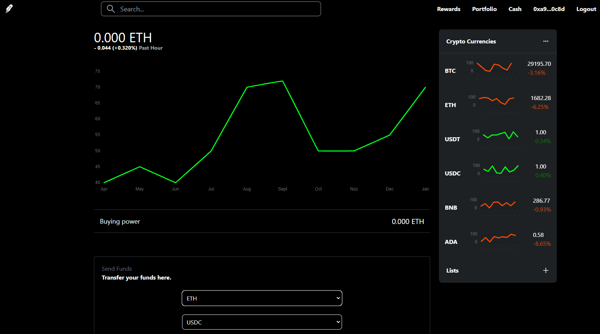
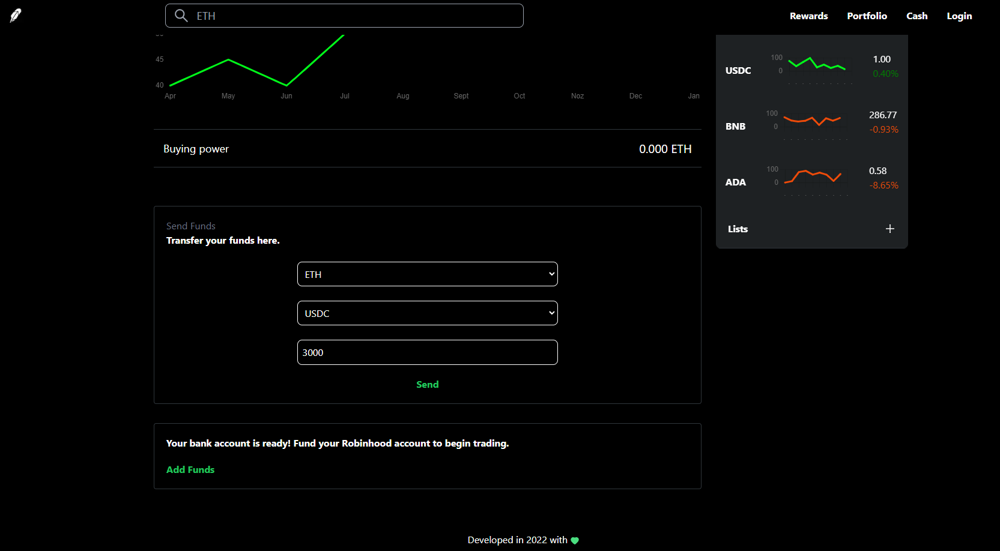

# blockchain-robinhood-clone

 Web3 Robinhood clone app

 - Run next.js app: `npm run dev`
 - Run blockhain app (in /smart-contract directory) with test (Rinkeby) network: `npx hardhat run scripts/deploy.js --network rinkeby`
 - Run db/sanity app (in /studio directory): `sanity start`

## Demo images

